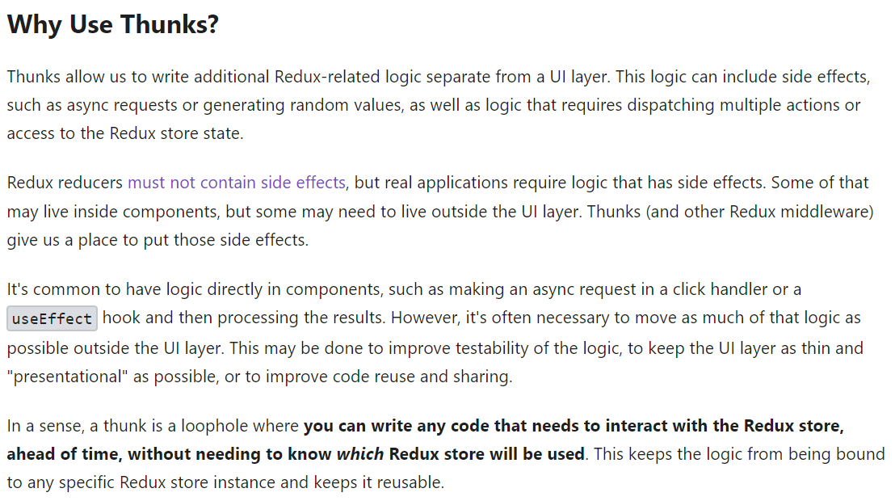

Redux middleware - https://www.youtube.com/watch?v=LvsiqAyFzPk&t=2581s 
1. Thunk are functions used to delay a functionality. 
2. actions are by default synchronous 
3. to have asynchronous action, we can wrap it in a thunk function 

Detailed documentation - https://redux.js.org/usage/writing-logic-thunks 

Setup: 
import { createStore, applyMiddleware } from 'redux' 
import { thunk } from 'redux-thunk' 
import rootReducer from './reducers/index' 

const store = createStore(rootReducer, applyMiddleware(thunk)) 

Writing Thunk: 
A thunk function is a function that accepts two arguments: the Redux store dispatch() method, and the Redux store getState() method. Thunk functions are not directly called by application code. Instead, they are passed to store.dispatch() 

